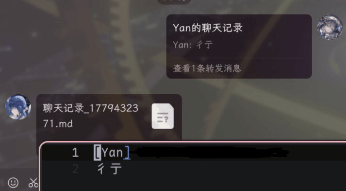
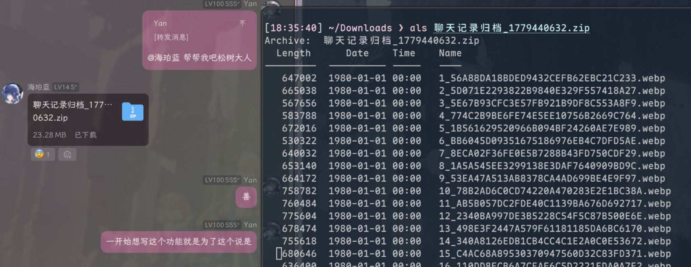

# Amberizer 琥珀化

将聊天记录转换为 markdown 文档，基于 onebot v11 协议的 qq 机器人。

# 构建

`cargo build --release`

产物位于 target/release/

# 运行

可以通过环境变量设置 amberizer 的部分选项，包括

| 名 | 例 | 默 | 用 |
| --- | --- | --- | --- |
| AMBERIZER_HOST | 127.0.0.1 | 127.0.0.1 | websocket 连接地址 |
| AMBERIZER_PORT | 3001 | 17210 | websocket 连接端口 |
| AMBERIZER_TOKEN | 55yL5oeC55qE5Y+Y54yr5aiYCg== | - | websocket token，未设置时可留空 |
| AMBERIZER_CACHE | /tmp/amberizer/cache | ./cache | 存放解析时产生的文件的目录，设置时必须存在 |
| AMBERIZER_CTR_CACHE | /cache | - | NapCat 容器内映射的cache目录，留空时使用与`AMBERIZER_CACHE`相同的目录 |
| AMBERIZER_CMD | 生成琥珀 | 帮帮我吧松树大人 | 在群聊中调用时使用的指令正文 |

> 本程序修改了[onebot_v11](https://docs.rs/onebot_v11/)的部分代码以适配 NapCat 的合并转发消息获取接口，因此可能仅适用于 NapCat  
> ~~除非别的qq onebot框架也用了 NapCat 的这个私有 API 格式~~

# 使用方式

群聊：引用需要琥珀化的合并转发消息，@机器人，正文为「帮帮我吧松树大人」（或自定义的指令）

私聊：直接发送合并转发

如果转发内容仅包含文本信息，bot 会直接发送 聊天记录.md 文件

如果转发内容包含图片、视频等，bot会按顺序下载，并最终打包为 zip 进行发送

# 效果图

# 已知问题

- 由于 NapCat 限制，无法解析嵌套聊天记录
- 无法正确获取发送者的QQ号，以及有概率丢失用户名（回退为"QQ用户"）
- B站视频分享卡片等数据复杂度稍高且格式不统一（NapCat直接以原始json格式发送内容），暂未解析
